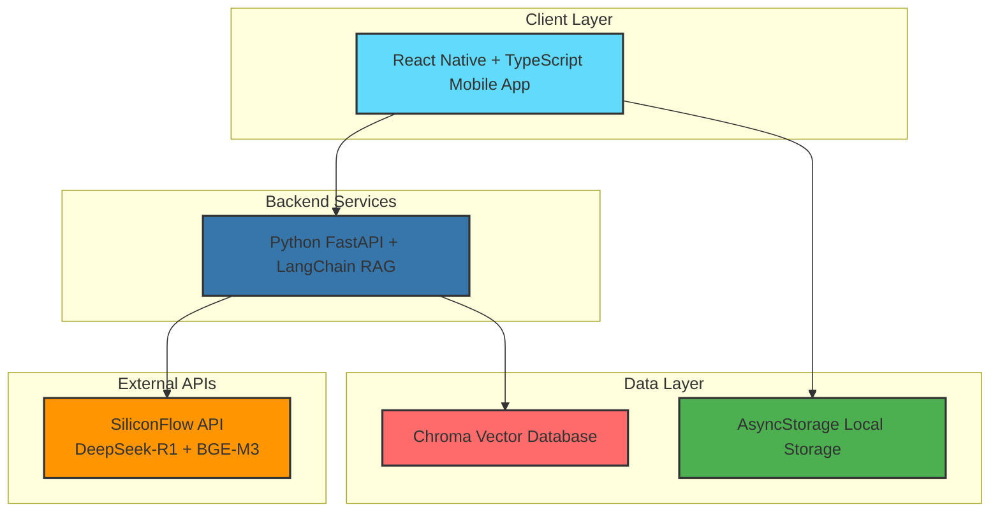

# BodyMind_AI 🦾

**Your Personal AI Fat Loss Expert. Say goodbye to ineffective efforts and achieve scientific precision in weight loss.**

---

## 📖 Project Vision

Weight loss is a prolonged battle for modern people. We often find ourselves trapped in endless trending methods like "keto diets," "juice cleanses," and "sauna suits," only to face plateaus, weight rebound, or even health damage. The root cause? We're fighting against a powerful enemy—pseudo-science fueled by commercial hype and blind efforts that don't suit our individual needs.

`BodyMind_AI` was born to end this chaotic war. We firmly believe that **the only sustainable fat loss path comes from understanding science and respecting individual differences.**

Our core mission is to become your most trusted AI fat loss expert:

1. **Science Only**: Our knowledge base exclusively contains authoritative papers and research from top global scientific platforms (like PubMed) on **metabolism, nutrition science, and exercise science**. We arm every fat loss decision with hardcore scientific evidence.

2. **Ultimate Personalization**: Your body is unique. Based on your age, height, weight, body fat percentage, lifestyle, and fat loss goals, we use AI Large Language Models (LLM) and Retrieval-Augmented Generation (RAG) technology to calculate your Total Daily Energy Expenditure (TDEE) and create **precise meal plans down to macronutrients (carbs, protein, fat)** and **the most efficient fat-burning workout combinations**.

3. **Solve Every Challenge**: "What to do when hitting a plateau?", "How to arrange strength and cardio for fastest fat loss?", "Is 16:8 intermittent fasting really right for me?"... Ask the AI anytime and get reliable answers with scientific sources that solve your specific current problems.

`BodyMind_AI` isn't just another fitness app—it's your dedicated fat loss strategist, helping you bypass all detours and reach your goals directly.

## ✨ Core Features

* **🧬 Personalized Fat Loss Plans**: Input your personal data, and AI will generate weekly diet and training plans centered on "creating a caloric deficit."
* **📚 Expert-Level Fat Loss Q&A (RAG)**: Get precise answers based on scientific literature for any specific questions during your fat loss journey.
* **🕸️ Cutting-Edge Knowledge Dynamic Updates (Web Crawler)**: Background crawler system regularly fetches the latest fat loss research, ensuring your plans are always based on the most current science.
* **👤 Fat Loss Profile Management**: Record your weight changes, diet, and training logs, allowing AI to continuously optimize your plan.

## 🏗️ System Architecture



## 🛠️ Technology Stack

* **Mobile App**: `React Native`, `TypeScript`, `Expo`, `React Navigation`
* **Backend**: `Python 3.10`, `FastAPI`, `LangChain`, `Uvicorn`
* **Database**: `Chroma` (Vector DB), `AsyncStorage` (Local Storage)
* **AI Services**: `SiliconFlow API`, `DeepSeek-R1`, `BGE-M3 Embeddings`
* **DevOps**: `Docker`, `docker-compose`

## 🔥 Technical Skills & Learning

* **AI/ML Integration**: Implementing RAG systems with LangChain, working with vector databases and embedding models
* **Full-Stack Development**: React Native TypeScript frontend + Python FastAPI backend integration
* **Modern Architecture**: Building scalable applications with FastAPI and containerized deployment
* **Mobile Development**: React Native with Expo, TypeScript, and professional UI/UX design
* **Best Practices**: Clean code, proper error handling, bilingual i18n support, and maintainable architecture

## 🌍 Remote-Ready Development

* **Containerized Setup**: Docker configuration for easy local development and team onboarding
* **Clear Documentation**: Well-documented code, architecture diagrams, and comprehensive README
* **Clean API Design**: RESTful FastAPI services with OpenAPI documentation
* **Team-Friendly**: Structured for code reviews, pair programming, and distributed team workflows
* **Bilingual Support**: Professional i18n system supporting English and Chinese

## 🚀 MVP Roadmap

- **v0.1: Core Fat Loss Logic Validation** - `Completed`
  - [x] Implement core RAG pipeline with LangChain and Chroma vector database
  - [x] Build React Native mobile interface for profile setup and AI chat
  - [x] Complete FastAPI backend with TDEE calculation and food/exercise parsing

- **v0.2: UI/UX Completion** - `In Progress`
  - [x] Complete bilingual support (English/Chinese) with i18n system
  - [ ] Implement SettingsScreen for user preferences
  - [ ] Build ProgressScreen with data visualization
  - [ ] Add tab navigation for better user experience

- **v0.3: Enhanced Features**
  - [ ] Improve document upload pipeline for knowledge base expansion
  - [ ] Add user authentication and profile persistence
  - [ ] Implement offline mode support

- **v0.4: Production Deployment**
  - [ ] Optimize performance and add comprehensive error handling
  - [ ] Deploy to production environment
  - [ ] Add monitoring and analytics

## 👤 About the Author

Hi, I'm **Qin**, a **University of Pennsylvania Master's graduate**.

I'm passionate about backend engineering and cloud architecture (holding **AWS SAA** & **CKA** certifications) and am currently diving deep into the artificial intelligence field with great enthusiasm. With a strong academic foundation and hands-on project experience, I'm focused on building scalable, intelligent systems.

`BodyMind_AI` represents my commitment to combining cutting-edge technology with real-world problem-solving and continuous learning.

---

**Let's use code and science to precisely sculpt your ideal physique.**

## 🌐 Live Demo & Documentation

* **Frontend Demo**: [Coming Soon] - Interactive UI mockup showcasing user experience
* **API Documentation**: [Coming Soon] - Comprehensive backend API specifications
* **Architecture Walkthrough**: [Coming Soon] - Video explanation of system design decisions
* **Source Code**: Available in this repository with detailed documentation

## 📁 Project Structure

This project follows professional full-stack architecture with clear separation of concerns:

```
BodyMind_AI/
├── 📱 mobile/              # React Native App with Google Material Design
│   ├── screens/            # Welcome, Profile, Chat, Plan screens
│   ├── components/         # Reusable UI components
│   └── App.tsx            # Navigation & app entry point
├── 🖥️ backend/             # Backend services
│   └── ai-service/         # Python FastAPI + LangChain RAG
├── 🔗 shared/              # Shared types and utilities
├── 🏗️ infrastructure/       # Docker, deployment, and DevOps
├── 📚 docs/                # Development guides and documentation
├── 📦 package.json         # Monorepo configuration
└── 🐳 docker-compose.yml   # Multi-service orchestration
```

**Current Status**: ✅ **Core Features Completed!**
- React Native app with Material Design and bilingual support
- Python FastAPI backend with LangChain RAG system
- Real-time AI chat with scientific source citations
- Profile setup with TDEE calculations
- Food and exercise logging with AI parsing
- Progress tracking with weight trends and nutrition visualization
- Complete tab navigation (Chat, Plan, Progress, Settings)

## 🚀 Quick Start

### Prerequisites
- Node.js 18+
- Python 3.10+
- Expo CLI
- Docker (optional)

### Development Mode

**Option 1: Mobile App Only (Fastest)**
```bash
cd mobile
npm install
npm run web          # Browser: http://localhost:19006
```

**Option 2: Full Stack Development**
```bash
# Terminal 1: Start AI service
cd backend/ai-service
python -m uvicorn app.main:app --reload --host 0.0.0.0 --port 8765

# Terminal 2: Start mobile app  
cd mobile
npm run web          # Browser: http://localhost:19006
```

### View the App
1. Open browser: `http://localhost:19006`
2. Press **F12** → Toggle device toolbar → Select **iPhone 14 Pro**
3. Experience the bilingual AI-powered fat loss expert!

## 📄 License

This project is licensed under the MIT License - see the [LICENSE](LICENSE) file for details.

## 🤝 Contributing

Contributions are welcome! Please feel free to submit a Pull Request.

## 🎯 Open to Opportunities

Currently seeking **remote junior to mid-level full-stack or AI engineering roles** with:
* International teams building impactful, user-focused products
* Opportunities to grow and learn from experienced engineers
* Modern tech stacks where I can contribute and expand my skills
* Companies that value innovation, mentorship, work-life balance, and continuous learning

*Eager to contribute to meaningful projects and grow with a supportive remote team.*

## 📞 Contact

**Email**: qinw.official@gmail.com

---

*Built with ❤️ and powered by science.*  