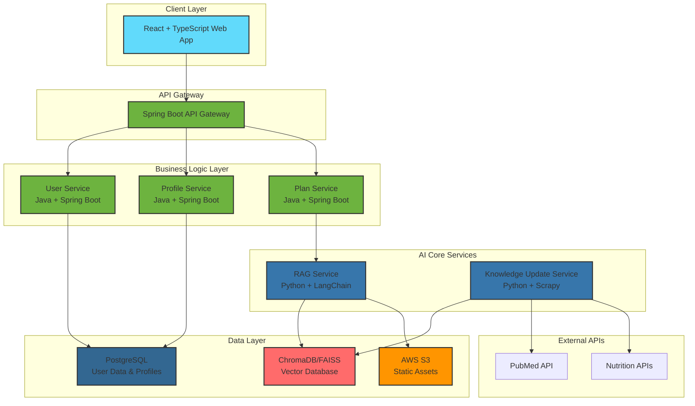

# BodyMind_AI 🦾

**Your Personal AI Fat Loss Expert. Say goodbye to ineffective efforts and achieve scientific precision in weight loss.**

---

## 📖 Project Vision

Weight loss is a prolonged battle for modern people. We often find ourselves trapped in endless trending methods like "keto diets," "juice cleanses," and "sauna suits," only to face plateaus, weight rebound, or even health damage. The root cause? We're fighting against a powerful enemy—pseudo-science fueled by commercial hype and blind efforts that don't suit our individual needs.

`BodyMind_AI` was born to end this chaotic war. We firmly believe that **the only sustainable fat loss path comes from understanding science and respecting individual differences.**

Our core mission is to become your most trusted AI fat loss expert:

1. **Science Only**: Our knowledge base exclusively contains authoritative papers and research from top global scientific platforms (like PubMed) on **metabolism, nutrition science, and exercise science**. We arm every fat loss decision with hardcore scientific evidence.

2. **Ultimate Personalization**: Your body is unique. Based on your age, height, weight, body fat percentage, lifestyle, and fat loss goals, we use AI Large Language Models (LLM) and Retrieval-Augmented Generation (RAG) technology to calculate your Total Daily Energy Expenditure (TDEE) and create **precise meal plans down to macronutrients (carbs, protein, fat)** and **the most efficient fat-burning workout combinations**.

3. **Solve Every Challenge**: "What to do when hitting a plateau?", "How to arrange strength and cardio for fastest fat loss?", "Is 16:8 intermittent fasting really right for me?"... Ask the AI anytime and get reliable answers with scientific sources that solve your specific current problems.

`BodyMind_AI` isn't just another fitness app—it's your dedicated fat loss strategist, helping you bypass all detours and reach your goals directly.

## ✨ Core Features

* **🧬 Personalized Fat Loss Plans**: Input your personal data, and AI will generate weekly diet and training plans centered on "creating a caloric deficit."
* **📚 Expert-Level Fat Loss Q&A (RAG)**: Get precise answers based on scientific literature for any specific questions during your fat loss journey.
* **🕸️ Cutting-Edge Knowledge Dynamic Updates (Web Crawler)**: Background crawler system regularly fetches the latest fat loss research, ensuring your plans are always based on the most current science.
* **👤 Fat Loss Profile Management**: Record your weight changes, diet, and training logs, allowing AI to continuously optimize your plan.

## 🏗️ System Architecture

## 🛠️ Technology Stack

* **Frontend**: `React`, `TypeScript`, `Vite`, `Axios`, `Tailwind CSS`
* **Backend Business Layer**: `Java 17`, `Spring Boot 3`, `gRPC-Java`
* **AI Core Services**: `Python 3.10`, `LangChain`, `FastAPI`, `gRPC-Python`, `Scrapy`
* **Databases**: `ChromaDB`/`FAISS` (Vector DB), `PostgreSQL`/`MySQL` (Relational DB)
* **DevOps & Deployment**: `Docker`, `GitHub Actions`, `AWS (EC2/ECS, S3, RDS, ECR)`

## 🔥 Technical Skills & Learning

* **Modern Architecture**: Building scalable microservices with Java Spring Boot and exploring gRPC for efficient service communication
* **AI/ML Integration**: Implementing RAG systems with LangChain, working with vector databases and automated data pipelines
* **Cloud & DevOps**: Hands-on experience with AWS services, Docker containerization, and CI/CD automation
* **Full-Stack Development**: React TypeScript frontend + Java backend + Python AI services integration
* **Best Practices**: Focused on clean code, proper error handling, comprehensive testing, and maintainable architecture

## 🌍 Remote-Ready Development

* **Containerized Setup**: Docker configuration for easy local development and team onboarding
* **Clear Documentation**: Well-documented code, architecture diagrams, and comprehensive README
* **CI/CD Implementation**: GitHub Actions for automated testing and deployment workflows
* **Clean API Design**: RESTful services with clear contracts for team collaboration
* **Team-Friendly**: Structured for code reviews, pair programming, and distributed team workflows

## 🚀 MVP Roadmap

- **v0.1: Core Fat Loss Logic Validation** - `In Progress`
  - [ ] Implement core RAG pipeline with knowledge base using manually downloaded **5-10 classic papers on caloric deficit and macronutrient allocation**.
  - [ ] Build basic web interface for inputting body data and displaying AI results.
  - [ ] Complete gRPC calls from Java backend to Python AI services, establishing end-to-end pipeline.

- **v0.2: Containerization & Continuous Integration**
  - [ ] Write Dockerfile and implement one-click local deployment using `docker-compose`.
  - [ ] Configure GitHub Actions for CI/CD, automatically pushing images to AWS ECR.

- **v0.3: Automated Knowledge Pipeline**
  - [ ] Develop Scrapy crawler to specifically scrape paper abstracts from PubMed using keywords like "fat loss", "metabolism".
  - [ ] Establish automated data processing pipeline to update vector database.

- **v0.4: User System & Cloud Deployment**
  - [ ] Implement user registration/login and save personal fat loss profiles.
  - [ ] Deploy MVP version to AWS cloud environment.

## 👤 About the Author

Hi, I'm **Qin**, a **University of Pennsylvania Master's graduate**.

I'm passionate about backend engineering and cloud architecture (holding **AWS SAA** & **CKA** certifications) and am currently diving deep into the artificial intelligence field with great enthusiasm. With a strong academic foundation and hands-on project experience, I'm focused on building scalable, intelligent systems.

`BodyMind_AI` represents my commitment to combining cutting-edge technology with real-world problem-solving and continuous learning.

---

**Let's use code and science to precisely sculpt your ideal physique.**

## 🌐 Live Demo & Documentation

* **Frontend Demo**: [Coming Soon] - Interactive UI mockup showcasing user experience
* **API Documentation**: [Coming Soon] - Comprehensive backend API specifications
* **Architecture Walkthrough**: [Coming Soon] - Video explanation of system design decisions
* **Source Code**: Available in this repository with detailed documentation

## 🚀 Quick Start

Coming soon! The project is currently in active development.

## 📄 License

This project is licensed under the MIT License - see the [LICENSE](LICENSE) file for details.

## 🤝 Contributing

Contributions are welcome! Please feel free to submit a Pull Request.

## 🎯 Open to Opportunities

Currently seeking **remote junior to mid-level full-stack or AI engineering roles** with:
* International teams building impactful, user-focused products
* Opportunities to grow and learn from experienced engineers
* Modern tech stacks where I can contribute and expand my skills
* Companies that value innovation, mentorship, work-life balance, and continuous learning

*Eager to contribute to meaningful projects and grow with a supportive remote team.*

## 📞 Contact

**Email**: qinw.official@gmail.com

---

*Built with ❤️ and powered by science.*  